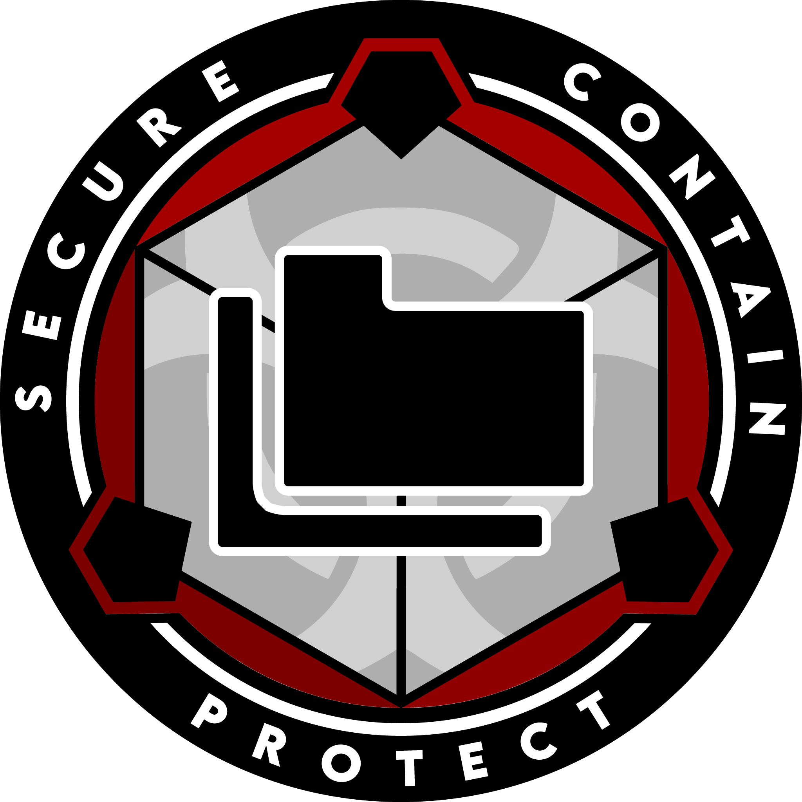

# Recordkeeping and Information Security Administration

{ loading=lazy; width="150"; height="110"; align=left } Recordkeeping and Information Security Administration (RAISA) at Site 23 is a crucial department entrusted with the vital tasks of maintaining and securing Foundation records, managing web assets, and ensuring the integrity and confidentiality of information within the facility.

RAISA operates with the highest standards of accuracy, efficiency, and security to oversee the comprehensive recordkeeping system at Site 23. They establish and enforce protocols for the proper classification, organization, and storage of records, ensuring easy retrieval and efficient management of information. By maintaining meticulous records, RAISA supports other departments in their operational requirements and facilitates the smooth functionality of the facility.

Information security is a top priority for RAISA, and they employ robust measures to protect sensitive and classified data from unauthorized access, breaches, or leaks. They implement stringent access controls, encryption techniques, and regular audits to safeguard the confidentiality and integrity of Foundation information. RAISA collaborates closely with other security departments to identify and address potential vulnerabilities, proactively mitigating risks and ensuring compliance with established security policies.

Managing Foundation web assets is another key responsibility of RAISA. They oversee the development, maintenance, and security of websites and other digital platforms within the facility. By implementing best practices in web design, content management, and cybersecurity, RAISA ensures that Foundation web assets are user-friendly, up-to-date, and protected from cyber threats.

RAISA also plays a vital role in disaster recovery and business continuity planning. They develop and implement backup strategies, redundant systems, and protocols for data recovery in the event of unforeseen incidents. By proactively preparing for potential disruptions, RAISA helps to minimize downtime and ensure the availability of critical information and services.

In addition to their recordkeeping and information security responsibilities, RAISA provides guidance and training to personnel on data management, confidentiality, and compliance with regulatory requirements. They actively monitor and enforce adherence to Foundation policies, promoting a culture of information security and responsible data handling throughout the facility.

Site 23's Recordkeeping and Information Security Administration (RAISA) is dedicated to maintaining the integrity, security, and accessibility of Foundation records and information. Through their meticulous recordkeeping practices, robust information security measures, and efficient management of web assets, RAISA supports the operational needs of the facility while upholding the highest standards of confidentiality and compliance.