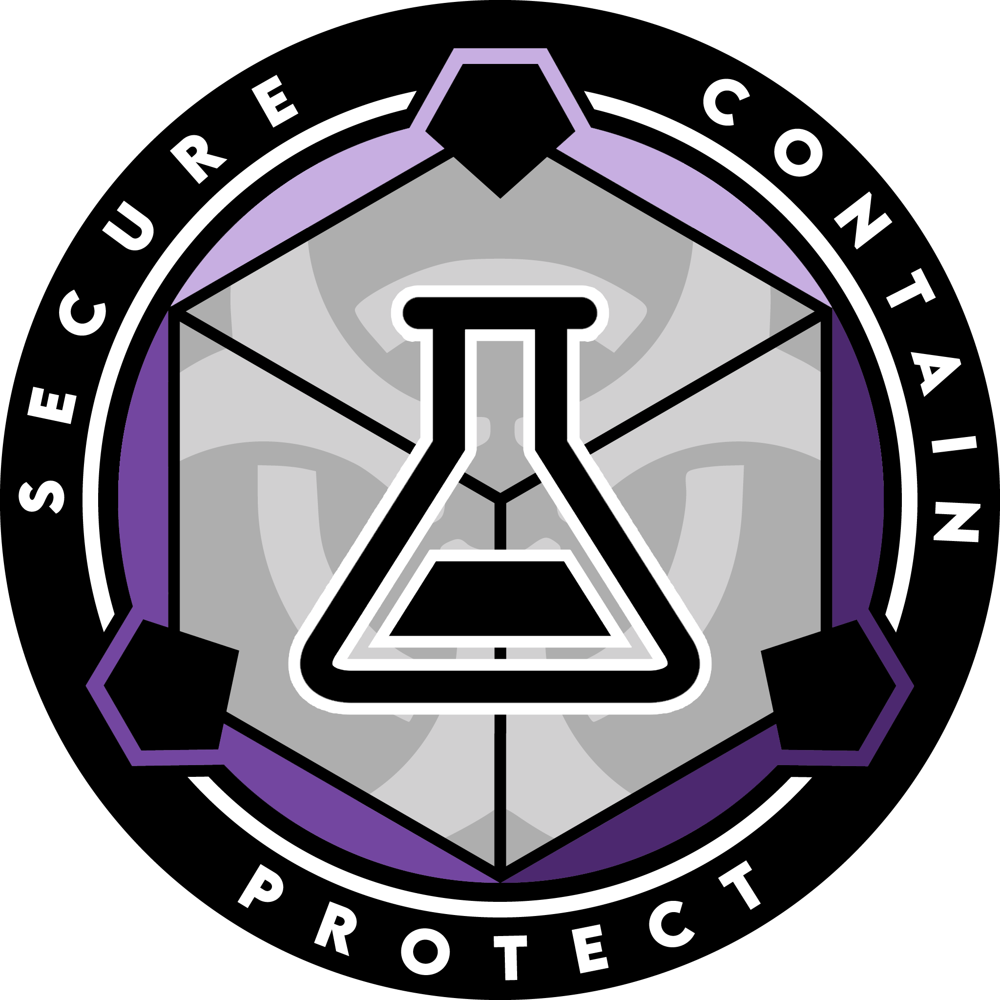

# Scientific Department

{ loading=lazy; width="150"; height="110"; align=left } Site 23's Scientific Department (ScD) is a specialized division entrusted with the critical tasks of researching advanced weapon systems and studying anomalous entities. With their expertise and cutting-edge facilities, ScD plays a pivotal role in expanding the Foundation's knowledge and capabilities in these areas.

The highly skilled scientists, researchers, and technicians of ScD are at the forefront of developing advanced weapon systems. They explore emerging technologies, conduct experimental research, and analyze anomalous phenomena to devise innovative and effective means of neutralizing potential threats. Through rigorous testing and evaluation, ScD aims to enhance the Foundation's defensive capabilities, ensuring the safety of personnel and the containment of anomalous entities.

In addition to weapon systems research, ScD is dedicated to studying anomalous entities in order to better understand their properties, behaviors, and origins. Through comprehensive investigations, controlled experiments, and collaboration with other sites and research teams, ScD strives to unlock the mysteries surrounding these entities. Their findings contribute to the development of containment procedures, risk assessment protocols, and the overall knowledge base of the Foundation.

ScD operates state-of-the-art laboratories and research facilities, equipped with specialized equipment and containment chambers designed to handle and study anomalous entities safely. They adhere to strict safety protocols and ethical guidelines to protect both personnel and the surrounding environment during their research endeavors.

Collaboration is a key aspect of ScD's work. They actively engage with other departments, such as the Engineering & Technical Service and Security Service, to ensure the safety and integrity of their research projects. They also share their discoveries, methodologies, and technological advancements with the broader scientific community within the Foundation, fostering a culture of knowledge exchange and continuous improvement.

Through their unwavering dedication to scientific research, Site 23's Scientific Department advances the understanding of advanced weapon systems and contributes to the Foundation's comprehensive knowledge of anomalous entities. Their efforts are instrumental in protecting personnel, mitigating threats, and supporting the Foundation's mission to secure, contain, and protect the anomalous.