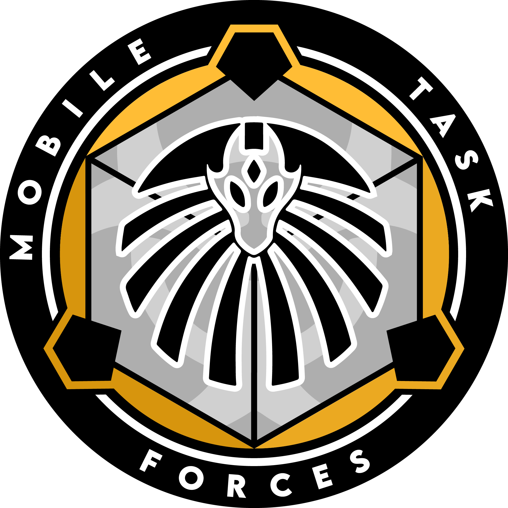

# MTF Epsilon-11 ("Nine-Tailed Fox")

**:material-file-sign: Lore File** [What's this?](https://www.site23.xyz/departments#lore-files)

{ loading=lazy; width="150"; height="110"; align=right } Mobile Task Force Epsilon-11, codenamed "Nine-Tailed Fox," is a highly classified and specialized unit responsible for handling internal security matters within the Foundation. Operating as a special operations force, Epsilon-11 is deployed when standard security protocols fail and multiple breaches are imminent at Foundation Sites. Their primary mission is to contain, neutralize, and regain control in high-risk situations where the security and integrity of the facility are compromised.

Epsilon-11 consists of highly trained personnel with backgrounds in special operations, counterterrorism, and advanced combat tactics. They possess exceptional skills in close-quarters combat, covert operations, and crisis management. Their training enables them to swiftly respond to critical incidents and adapt to rapidly changing scenarios.

One of the key roles of Epsilon-11 is to handle internal security matters within the Foundation. They investigate and address security breaches, uncover potential threats from within, and ensure the safety and trustworthiness of Foundation personnel. Their operations in this capacity are conducted with utmost discretion and confidentiality to maintain the integrity of ongoing investigations and protect the Foundation's reputation.

Additionally, Epsilon-11 serves as a rapid response force during critical situations where multiple breaches are imminent. They are deployed to Foundation Sites when standard protocols have been compromised or overwhelmed. Their presence serves as a powerful deterrent to potential threats and provides an additional layer of security for the containment of anomalous entities or objects.

Due to the sensitive nature of their operations, the majority of Epsilon-11's activities are classified, known only to authorized personnel within the Foundation. This classification ensures operational security and protects the confidentiality of their methods and techniques.

Epsilon-11 operates under a decentralized command structure, with small, highly autonomous teams that collaborate and coordinate with each other as required. Their flexibility and adaptability allow them to respond to a wide range of threats, whether it be armed hostiles, containment breaches, or internal security breaches.

The members of Epsilon-11 undergo rigorous training and regular assessments to maintain their readiness and effectiveness. They receive specialized equipment, advanced weaponry, and tactical support to enhance their operational capabilities.

Mobile Task Force Epsilon-11, "Nine-Tailed Fox," represents the Foundation's elite force for internal security matters and rapid response in critical situations. Through their specialized training, covert operations, and swift action, they uphold the security and integrity of the Foundation, safeguard personnel, and ensure the containment of anomalous threats.