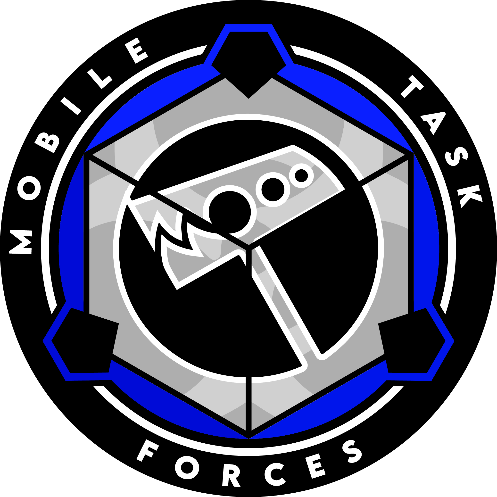

# MTF Nu-7 ("Hammer Down")

{ loading=lazy; width="150"; height="110"; align=left } Mobile Task Force Nu-7, codenamed "Hammer Down," is a highly trained and specialized battalion-strength force tasked with responding to critical incidents involving the loss of communication with major Foundation facilities. Operating under the most dire circumstances, such as site-wide breaches, enemy compromises, or other catastrophic events, Nu-7 is mobilized to restore communication, assess the situation, and neutralize threats if necessary.

Comprised of elite special forces personnel, Nu-7 undergoes rigorous training in combat tactics, crisis response, and advanced weaponry. They are equipped with state-of-the-art equipment, specialized vehicles, and advanced communication systems to effectively operate in high-risk environments.

When a major Foundation facility experiences a loss of communication and there are indications of a severe breach or compromise, Nu-7 is swiftly deployed. Their primary objective is to reestablish communication with the facility, assess the situation, and neutralize any threats that may pose a risk to Foundation assets or personnel.

Nu-7 operates with a coordinated and strategic approach, utilizing their specialized skills in reconnaissance, intelligence gathering, and combat. They work in teams to secure key areas, neutralize hostiles, and restore communication systems. Their primary focus is on reestablishing control, containing the situation, and minimizing further damage or loss.

In addition to their combat capabilities, Nu-7 is trained in emergency response and disaster management. They are equipped to handle hazardous materials, provide medical assistance, and support evacuation efforts if required. Their versatility enables them to adapt to the specific needs of each situation they encounter.

Nu-7 operates under a hierarchical command structure, with experienced officers leading the teams in the field. They maintain close coordination with other Mobile Task Forces, security departments, and relevant on-site personnel to gather intelligence and maximize efficiency during their operations.

While Nu-7 primarily responds to incidents involving major Foundation facilities, they are also prepared to assist in other critical situations as directed by Foundation leadership. Their expertise in handling high-risk scenarios and their ability to rapidly deploy make them a vital asset in safeguarding Foundation operations and assets.

Mobile Task Force Nu-7, "Hammer Down," represents the Foundation's swift and decisive response to catastrophic events and breaches. Through their specialized training, advanced equipment, and coordinated operations, they restore communication, neutralize threats, and reinforce the Foundation's ability to withstand and overcome significant challenges.