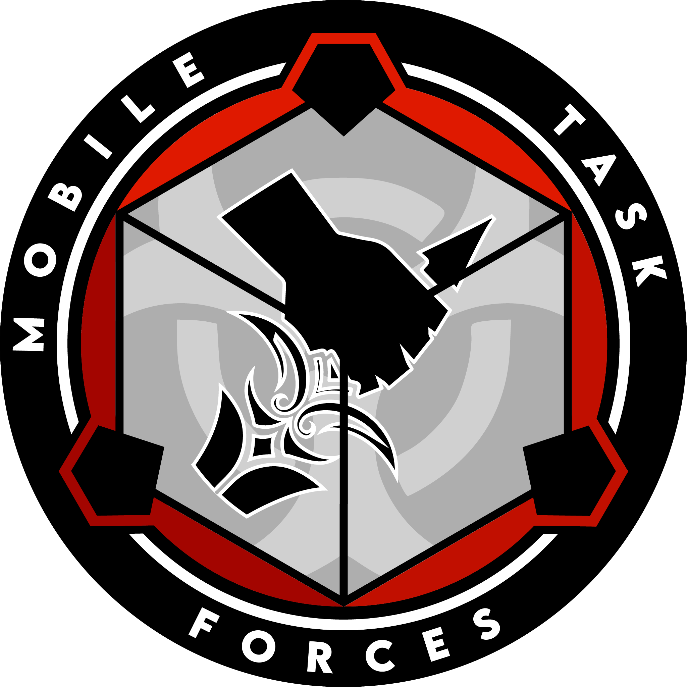

# MTF Omega-1 ("Law's Left Hand")

**:material-file-sign: Lore File** [What's this?](https://www.site23.xyz/departments#lore-files)

{ loading=lazy; width="150"; height="110"; align=right } Mobile Task Force Omega-1, codenamed "Law's Left Hand," is a specialized unit empowered with the authority to remove or execute high-ranking Foundation personnel if they are found to be acting unethically or compromising the organization's principles. Omega-1 operates under the direct command and supervision of the Internal Security Service's Ethics Committee.

Omega-1 consist of highly trained and elite agents, selected for their exceptional skills in covert operations, intelligence gathering, and combat. They undergo rigorous screening and are bound by strict ethical standards themselves, ensuring their unwavering dedication to the Foundation's mission and principles.

The primary objective of Omega-1 is to maintain the integrity and moral compass of the Foundation. When credible evidence emerges suggesting high-ranking personnel are engaging in unethical behavior or pose a significant threat to the organization, the Internal Security Service's Ethics Committee may authorize Omega-1 to take action.

As an independent and autonomous task force, Omega-1 conducts thorough investigations, utilizing advanced surveillance techniques, intelligence analysis, and infiltration strategies to gather evidence against the targeted individuals. Once the evidence has been substantiated, and the Ethics Committee grants the directive, Omega-1 agents execute their mission swiftly and decisively.

Omega-1 operates with the highest level of discretion and secrecy, ensuring that their actions remain covert and their targets are unaware of their impending intervention. Their primary objective is to remove or neutralize compromised personnel while minimizing collateral damage and maintaining operational security.

In addition to their enforcement role, Omega-1 serves as a deterrent, reinforcing the importance of ethical conduct within the Foundation. The knowledge of their existence and capability acts as a reminder to all personnel of the consequences of straying from the Foundation's ethical framework.

While Omega-1 operates independently, they maintain close communication and report directly to the Internal Security Service's Ethics Committee. The Committee oversees their activities, ensures adherence to the Foundation's ethical guidelines, and provides guidance on critical decision-making processes.

Mobile Task Force Omega-1, the "Law's Left Hand", represents the last line of defense against high-ranking Foundation personnel who have violated ethical standards or jeopardized the Foundation's mission. Through their unwavering commitment to ethical conduct and decisive action, they safeguard the moral compass and integrity of the organization, answering only to the Internal Security Service's Ethics Committee, and serving as a symbol of accountability within the Foundation.