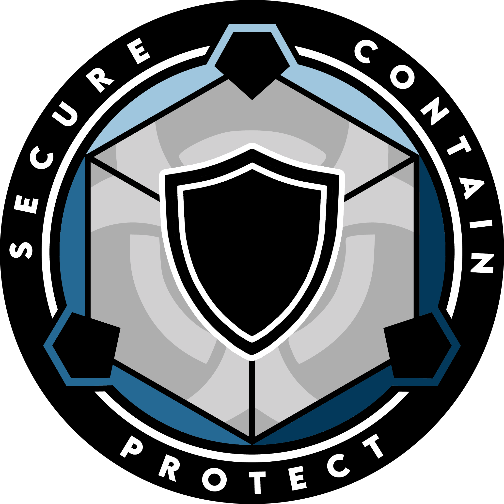

# Security Department

{ loading=lazy; width="150"; height="110"; align=left } The Security Department (SD) at Site 23 is a paramilitary force responsible for the protection and security of the facility. Committed to maintaining a safe and secure environment, SD personnel are highly trained and equipped to handle a wide range of security challenges and emergencies.

SD operates with a paramilitary structure, employing disciplined and dedicated personnel who undergo rigorous training in combat techniques, defensive tactics, crisis management, and situational awareness. They are skilled in firearms handling, crowd control, surveillance, and other essential security procedures to effectively respond to security threats.

The primary objective of SD is to safeguard the facility, its personnel, and its assets. They implement comprehensive security measures, including access controls, perimeter defenses, and surveillance systems, to prevent unauthorized access and maintain a high level of security at all times. SD personnel conduct regular patrols, monitor CCTV systems, and swiftly respond to any suspicious activities or breaches to ensure the prompt resolution of security incidents.

In addition to their protective duties, SD plays a crucial role in maintaining order and enforcing Foundation regulations within the facility. They enforce security protocols, conduct investigations into security incidents or violations, and work closely with other departments to ensure compliance with established guidelines and procedures.

SD personnel are also responsible for providing security escorts, managing emergency response procedures, and coordinating with external law enforcement agencies when necessary. They actively collaborate with other departments, such as Internal Security Service and Emergent Threat Tactical Response Authority, to maintain a coordinated approach in emergency situations and high-risk scenarios.

Furthermore, SD personnel undergo continuous training to stay updated on the latest security techniques, emerging threats, and technological advancements. They participate in drills, simulations, and exercises to enhance their response capabilities and maintain a state of preparedness.

The Security Department (SD) at Site 23 plays a critical role in ensuring the safety, protection, and order of the facility. Through their professionalism, training, and dedication, SD personnel uphold the highest standards of security, contributing to the smooth operation and mission success of Site 23.